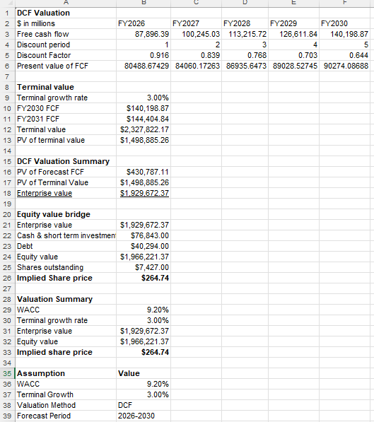
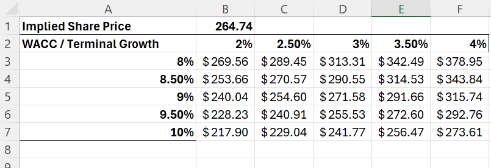

# Microsoft DCF Valuation

## Overview

This project builds a Discounted Cash Flow (DCF) valuation model for Microsoft Corporation (MSFT) using Excel.

The model forecasts Microsoft's free cash flow, calculates the weighted average cost of capital (WACC), discounts future cash flows to present value, and derives an implied enterprise value, equity value and share price.

## Objectives

- Analyse historical financial performance
- Forecast free cash flow over a five-year period
- Calculate WACC
- Estimate terminal value using the Gordon Growth Method
- Calculate enterprise value and equity value
- Derive an implied share price
- Perform WACC and terminal growth sensitivity analysis

## Methodology

The valuation follows a standard DCF framework:

**Historical Financials → Forecast → Free Cash Flow → WACC → DCF → Enterprise Value → Equity Value → Implied Share Price**

### Free Cash Flow

Forecast free cash flow was calculated using projected operating performance, taxes, capital expenditure and changes in net working capital.

### WACC

The weighted average cost of capital was calculated using:

- Risk-free rate
- Equity beta
- Equity risk premium
- Cost of equity
- Cost of debt
- Corporate tax rate
- Capital structure

The resulting WACC used in the base case was **9.20%**.

### Terminal Value

Terminal value was calculated using the Gordon Growth Method with a **3.00% terminal growth rate**.

### Sensitivity Analysis

A sensitivity table was constructed to evaluate how the implied share price changes under different combinations of:

- WACC: 8.0%–10.0%
- Terminal growth: 2.0%–4.0%

## Key Results

| Metric | Result |
|---|---:|
| WACC | 9.20% |
| Terminal Growth Rate | 3.00% |
| Enterprise Value | $1,929,672m |
| Equity Value | $1,966,221m |
| Implied Share Price | **$264.74** |

## Model Structure

The Excel workbook contains the following sections:

- **Historical Financials** – historical company financial data
- **Forecast** – projected financial performance and free cash flow
- **WACC** – cost of capital calculation
- **DCF Valuation** – discounted cash flow valuation
- **Sensitivity** – WACC and terminal growth sensitivity analysis

## Skills Demonstrated

- Financial modelling
- Discounted Cash Flow (DCF) valuation
- Excel
- Financial statement analysis
- Forecasting
- Free cash flow analysis
- WACC calculation
- Valuation sensitivity analysis
- Financial data interpretation

  ## Model Screenshots

### DCF Valuation

### Sensitivity Analysis

## Disclaimer

This project is for educational and portfolio purposes only and does not constitute investment advice.
